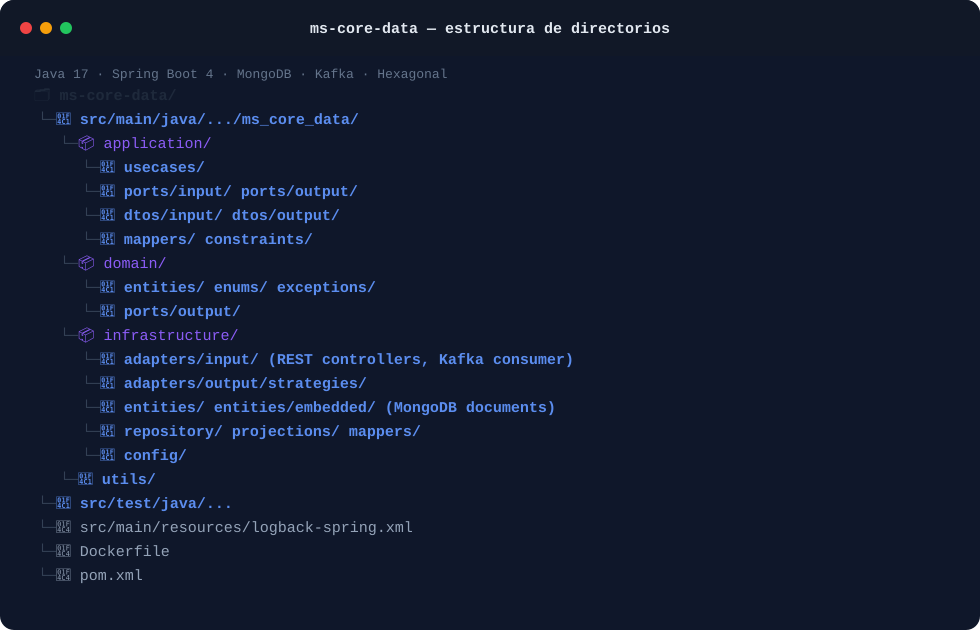

# ms-core-data

**Persistence and data-orchestration microservice for the RIntellix credit-risk platform.**

`Java 17` · `Spring Boot 4` · `MongoDB` · `Apache Kafka` · `Hexagonal Architecture`

---

## 1. Overview

`ms-core-data` is the system of record for RIntellix. It owns every persisted entity related to
a credit request: the request itself, its associated party, generated risk simulations, scoring
results, and reports. Other services never touch the database directly — they read and write
through this service's REST API or exchange events with it over Kafka.

In short, its responsibilities are:

- Expose CRUD-style REST endpoints for **requests**, **simulations** and **reports**.
- Persist domain data in **MongoDB**.
- Consume scoring events published by `ms-risk-engine` (via Kafka) and persist the resulting
  scoring outcome.
- Serve generated report files (PDF) produced by `ms-reporting`.

## 2. Key aspects of the system

- **Hexagonal architecture (ports & adapters).** The codebase is split into `domain`
  (entities, enums, exceptions and output ports), `application` (use cases, input ports, DTOs
  and mappers) and `infrastructure` (REST controllers, Kafka consumer, MongoDB repositories and
  entities). This keeps business rules independent from Spring, MongoDB or Kafka-specific code.
- **Event-driven scoring persistence.** `ScoringKafkaConsumer` listens for scoring events
  produced by `ms-risk-engine` and persists them through the domain layer, decoupling the
  calculation engine from the storage engine.
- **Strategy pattern on output adapters.** `infrastructure/adapters/output/strategies` allows
  the persistence/notification behaviour to vary per product type without branching logic in
  the use cases.
- **Read-model projections.** `infrastructure/projections` exposes lightweight MongoDB
  projections for list/detail views, avoiding over-fetching full documents.
- **Reactive endpoints where needed.** The service combines `spring-boot-starter-web` (MVC)
  with `spring-boot-starter-webflux` for endpoints that benefit from a reactive/non-blocking
  style (e.g. file streaming for report downloads).

### Main REST resources

| Resource | Base path | Notes |
|---|---|---|
| Requests | `/api/requests` | List, details, associated party, update (`PUT /api/requests/{requestId}`) |
| Simulations | `/api/simulations` | Full CRUD + partial update (`PATCH`) |
| Scoring | `/api/requests/{requestId}/scoring` | Read scoring result for a request |
| Reports | `/api/reports` | Create, list, filter by `requestId`, download file (`GET /{reportId}/file`) |

> The report file is served at `GET /api/reports/{reportId}/file`, **not** `/download`.

### Repository structure

The following schematic illustrates the source code layout and how the key architectural pieces described above map to the main project folders:



## 3. Tech stack

- **Language / runtime:** Java 17
- **Framework:** Spring Boot 4 (`spring-boot-starter-web`, `spring-boot-starter-webflux`,
  `spring-boot-starter-validation`, `spring-boot-starter-actuator`)
- **Persistence:** `spring-boot-starter-data-mongodb` (MongoDB)
- **Messaging:** `spring-kafka`
- **Utilities:** Lombok, Jackson

## 4. Prerequisites

- JDK 17+
- Maven 3.9+ (or use the provided `mvnw` if present, otherwise a local Maven install)
- Docker (recommended, via `spring-boot-docker-compose` for local MongoDB/Kafka)
- A running MongoDB instance and an Apache Kafka broker reachable by the service

## 5. Getting started

```bash
# 1. Clone the repository
git clone https://github.com/TFG-RIntellix/ms-core-data.git
cd ms-core-data

# 2. Provide configuration
# application.yaml / application.properties are intentionally gitignored.
# Create src/main/resources/application.yaml with your MongoDB URI, Kafka
# bootstrap servers and topic names (see "Configuration" below).

# 3. Run with Maven
mvn spring-boot:run

# — or build and run the jar —
mvn package -DskipTests
java -jar target/ms-core-data-0.0.1-SNAPSHOT.jar

# — or build the Docker image —
docker build -t ms-core-data .
docker run -p 8081:8081 ms-core-data
```

The service listens on **port 8081** by default (see `Dockerfile`).

## 6. Configuration

Because `application.yaml*` / `application.properties*` are excluded from version control
(`.gitignore`), you must supply your own configuration file with, at minimum:

- MongoDB connection URI and database name
- Kafka bootstrap servers and the scoring topic name(s) consumed/produced
- Server port (defaults to `8081`)

If you use `spring-boot-docker-compose`, a local `compose.yaml` (also gitignored) can spin up
MongoDB/Kafka automatically when running via `mvn spring-boot:run`.

## 7. Related services

- **ms-risk-engine** — publishes scoring events consumed by this service and calls it (via
  Feign) to read request/scoring data.
- **ms-reporting** — reads report metadata from this service and stores the generated PDF file
  through it.
- **ms-sec-gateway** — routes external traffic to this service and enforces authentication.

## 8. Author

Lucía Fernández Mancebo — TFG *RIntellix*, Universidad de Cantabria.


